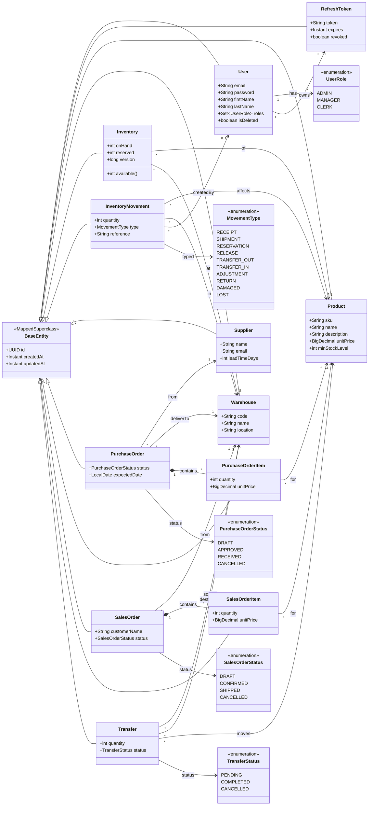

# StockFlow — Class Diagram

Domain model for the StockFlow inventory consistency engine. Every persistent entity extends
`BaseEntity` (UUID id + audit timestamps). Inventory is **never mutated directly** — the current
`Inventory` row is a running balance projected from the append-only `InventoryMovement` ledger,
where `available = onHand − reserved`.

## Key invariants

- `Inventory.available() == onHand − reserved`, and for every `(product, warehouse)`
  `onHand == sum(InventoryMovement.quantity)`.
- `Inventory.version` (JPA `@Version`) enforces optimistic locking so concurrent reservations
  cannot oversell.
- A `Transfer` produces a paired `TRANSFER_OUT` + `TRANSFER_IN` movement inside one transaction.
- Confirming a `SalesOrder` creates `RESERVATION` movements; shipping converts them to `SHIPMENT`.
- Receiving a `PurchaseOrder` creates `RECEIPT` movements.
