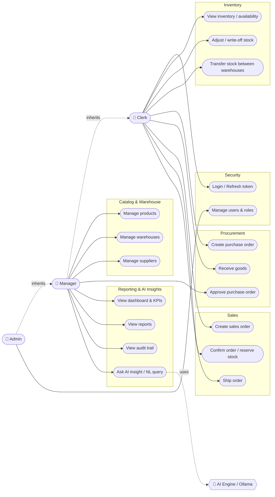

# StockFlow — Use Case Diagram

Actor–use-case map for StockFlow. Mermaid has no native UML use-case notation, so this is modelled
as a directed graph: **actors** (left) connect to the **use cases** they can perform, grouped by
module. Roles are hierarchical — `ADMIN` inherits everything `MANAGER` can do, and `MANAGER`
inherits the operational use cases of `CLERK`.

## Role responsibility summary

| Use case | Clerk | Manager | Admin |
|---|:---:|:---:|:---:|
| Login / refresh token | ✅ | ✅ | ✅ |
| View inventory / availability | ✅ | ✅ | ✅ |
| Adjust / write-off stock | ✅ | ✅ | ✅ |
| Transfer stock between warehouses | ✅ | ✅ | ✅ |
| Create purchase order | ✅ | ✅ | ✅ |
| Receive goods | ✅ | ✅ | ✅ |
| Create / confirm / ship sales order | ✅ | ✅ | ✅ |
| Manage products / warehouses / suppliers | | ✅ | ✅ |
| Approve purchase order | | ✅ | ✅ |
| Dashboard, reports, audit trail | | ✅ | ✅ |
| Ask AI insight (NL query) | | ✅ | ✅ |
| Manage users & roles | | | ✅ |

> Inheritance arrows (`inherits`) mean a higher role can also perform every use case of the roles
> below it, so the concrete role→use-case arrows above only show each role's **additional**
> capabilities.
